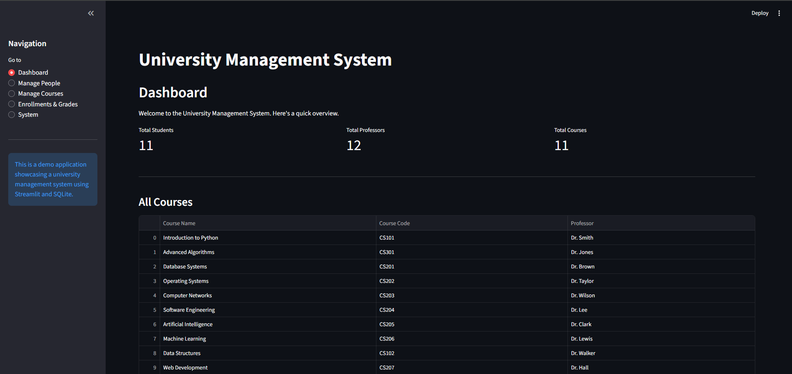

# University Management System

Petit projet demo pour gérer personnes, cours, inscriptions et notes via Streamlit + SQLite.

## Aperçu

- Interface Streamlit pour ajouter/consulter étudiants, professeurs et cours.
- Base de données SQLite (fichier `university.db`) gérée par `db_logic.py`.
- UI : `streamlit_app.py`.

## Installer / Lancer

1. Créer et activer un environnement Python.
2. Installer dépendances :
   ```
   pip install streamlit pandas
   ```
3. Lancer l'application :
   ```
   streamlit run streamlit_app.py
   ```

## Affichage d'une image


